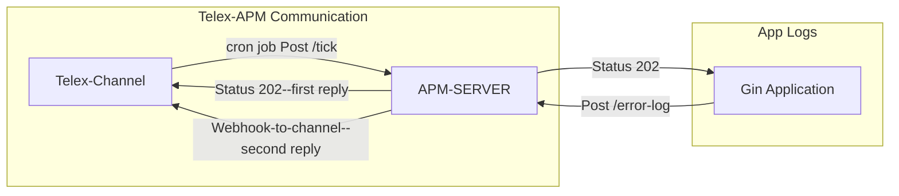

# Ekefan-go Telex Gin APM



Ekefan-go Gin APM is a lightweight APM for gin applications used as a [telex integration](https://docs.telex.im/docs/Integrations/intro) to notify [telex](https://docs.telex.im/docs/intro) users of errors that occur duing requests.

## How-to-Guide

To use this APM:

- Follow [telex](https://docs.telex.im/docs/intro) documentation to get started
- Create your channel and save the channel id.
- Instrument your gin application following this guide:
  - import the ekefan-go sdk for the apm:

    ```bash
    go get github.com/telexintegrations/ekefan-go/ginapm@latest
    ```

  - Instrument you application using this guide:
    - create a main.go file or setup your project and instrument it using ginapm middleware

    ```go
    package main
    import (
        "errors"
        "github.com/gin-gonic/gin"
        "github.com/telexintegrations/ekefan-go/ginapm"
        )
        func main() {
            // Intrument your application using the ginapm middleware
            r.Use(ginamp.GinAPM(ginamp.Config{
                TelexChanID:  "<your-telex-channel-id-where-logs-should-be-sent-to",
                ApmServerUrl: "https://ekefan-go.onrender.com/error-log",
            }))
            // Test route to trigger an error
            r.GET("/test-error", func(ctx *gin.Context) {
                // Very Important
                // To receive error logs, push the errors with a good description to the gin context
                ctx.Error(errors.New("this is a test error"))
                ctx.JSON(500, gin.H{"message": "an error occurred"})
            })
                // Healthy endpoint
            r.GET("/ping", func(ctx *gin.Context) {
                ctx.JSON(200, gin.H{"message": "pong"})
            })
            // Run the Gin server
            r.Run(":8080")
        }
    ```

- You are ready to receive error log notifications through telex
- You can always console logs to ensure no errors from communicating with the apm server

### For Manual Testing

- You need [golang installed](https://go.dev/doc/install), postman or any api testing client
- Follow the [How-to-Guide](#how-to-guide)
- Run the application:

  ```bash
  go run main.go
  ```

- Using your api testing client send a get request to `http://localhost:8080/test-error`
- To mimick telex's tick request, send a post request to `https://ekefan-go.onrender.com/tick` with this payload:

    ```json
    {
        "channel_id": "<your-telex-channel-id-where-logs-should-be-sent-to>",
        "return_url": "https://ping.telex.im/v1/webhooks/<your-telex-channel-id-where-logs-should-be-sent-to>",
        "settings": [
        {"Label": "interval", "Type": "text", "Required": true, "Default": "* * * * *"}
        ]
    }
    ```

- Your channel should notify you of the error that occured after request. Just like this:

.png>)

## Future Upgrades and Features

- Support for multiple channel notifications
- Improve CI and testing of the apm server
- Speed monitoring support
- Tracing support
- Full APM for go applications not just gin
