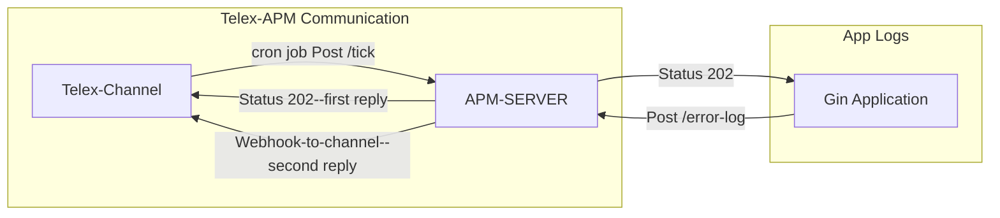

# Ekefan-go Telex Gin APM



Ekefan-go Gin APM is a lightweight APM for gin applications used as a [telex integration](https://docs.telex.im/docs/Integrations/intro) to notify [telex](https://docs.telex.im/docs/intro) users of errors that occur during requests.

## Setup Guide

To use this APM:

- You need [Golang installed](https://go.dev/doc/install) on your machine, postman or any  testing client
- Follow [Telex](https://docs.telex.im/docs/intro) documentation to get started
- Create your channel **(For Telex test org, the name of the channel is #gin-apm)**
- Get the channel Id from the Channels webhook configuration (find it here `...webhooks/<this is your channel id>`) **...webhooks/01952aac-f22a-7c3a-8803-7407f468829c For gin-apm, Telex test org channel**
- Configure Apps for the channel and activate `ekefan-go GIN APM`
- Instrument your Gin application following this guide:
  - Create a folder in your computer /telex-sample

    ```bash
    mkdir telex-sample
    cd telex-sample 
    ```

  - Initialize a Go module to handle dependency imports

    ```bash
    go mod init <the name of your module>
    ```

  - Install the Gin framework for building your application.

    ```bash
    go get github.com/gin-gonic/gin
    ```

  - Install the ekefan-go sdk for the apm:

    ```bash
    go get github.com/telexintegrations/ekefan-go/ginapm@latest
    ```

  - Instrument your application:
    - create a main.go file and instrument it using GinAPM middleware

    ```go
    package main
    import (
        "errors"
        "github.com/gin-gonic/gin"
        "github.com/telexintegrations/ekefan-go/ginapm"
    )
    func main() {
        r := gin.Default()
        // Intrument your application using the GinAPM middleware
        r.Use(ginapm.GinAPM(ginapm.Config{
            // TelexChanID should be your own channel ID
            TelexChanID:  "01952aac-f22a-7c3a-8803-7407f468829c", // Example:for Telex test org channel.
            ApmServerUrl: "https://ekefan-go.onrender.com/error-log", // You can pass this through Environment Variables
        }))
        // Test route to trigger an error
        r.GET("/test-error", func(ctx *gin.Context) {
            // Very Important
            // To receive error logs, push the errors with a good description to the Gin context
            ctx.Error(errors.New("this is a test error"))
            ctx.JSON(500, gin.H{"message": "an error occurred"})
        })
            // Healthy endpoint
        r.GET("/ping", func(ctx *gin.Context) {
            ctx.JSON(200, gin.H{"message": "pong"})
        })
        // Run the Gin server
        r.Run(":8080")
    }
    ```

- Add **ekefan-go GIN APM** app to your telex organisation to receive error notifications through Telex.
- You are ready to receive error notifications through Telex.
- Check the application logs to ensure there are no errors when communicating with the APM server

### For Manual Testing

- Follow the [Setup Guide](#setup-guide)
- Run the application:

  ```bash
  go run main.go
  ```

- Using your API testing client, send a get request to `http://localhost:8080/test-error`
- To simulate Telex's tick request, send a POST request to `https://ekefan-go.onrender.com/tick` with the following payload:

    ```json
   {
        "channel_id": "<your-telex-channel-id-where-logs-should-be-sent-to>",
        "return_url": "https://ping.telex.im/v1/webhooks/<your-telex-channel-id-where-logs-should-be-sent-to>",
        "settings": [
            {"Label": "interval", "Type": "text", "Required": true, "Default": "* * * * *"}
        ]
    }
    ```

    For Telex Test Organisation Channel:

    ```json
    {
        "channel_id": "01952aac-f22a-7c3a-8803-7407f468829c",
        "return_url": "https://ping.telex.im/v1/webhooks/01952aac-f22a-7c3a-8803-7407f468829c",
        "settings": [
            {"Label": "interval", "Type": "text", "Required": true, "Default": "* * * * *"}
        ]
    }
    ```

- Your channel should notify you of the error that occured after the request. Just like this:

.png>)

- To ensure the integration works, send a few more requests using your API testing client, to `http://localhost:8080/test-error` but **don't** simulate the request.

- At the set interval (1 minute) Telex will notify you of the test errors.

## Future Upgrades and Features

- Support for multiple channel notifications
- Speed monitoring support
- Tracing support
- Comprehensive APM for Go applications, not just gin.
